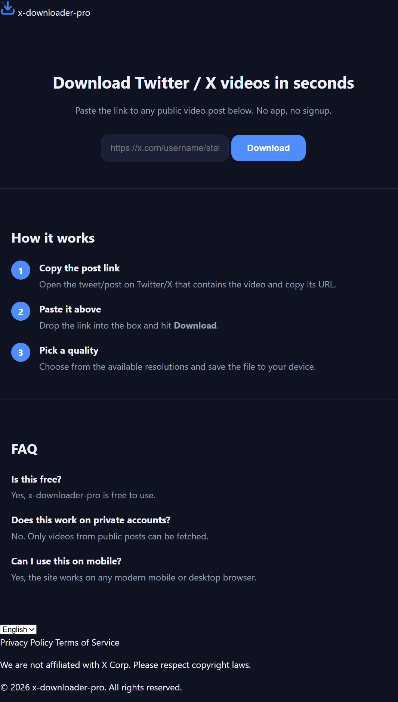

# X Downloader Pro

A fast, reliable, and modern web application to download videos from X (formerly Twitter) in high quality (up to 1080p). No app, no login, and no watermarks.




## 🚀 Features

- **High-Quality Downloads:** Fetch videos in multiple resolutions (1080p, 720p, 480p).
- **No Watermark:** Download clean videos directly from the source.
- **No Login Required:** Works entirely on public video links.
- **Mobile & Desktop Ready:** Fully responsive design optimized for iOS, Android, and Desktop browsers.
- **Modern UI:** Built with a sleek dark mode using Tailwind CSS.

## 🛠️ Tech Stack

- **Frontend:** HTML, Tailwind CSS, Vanilla JavaScript
- **Backend:** [Node.js](https://nodejs.org/) / Express
- **Video Extraction:** Custom scraping logic
- **Hosting:** [Vercel](https://vercel.com)
- **Domain:** [x-downloader.us.ci](https://x-downloader.us.ci)

## 🏃‍♂️ Getting Started

First, clone the repository and install the dependencies:

```bash
npm install
